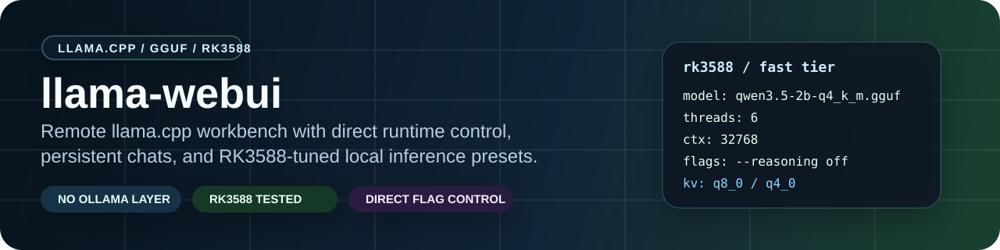

# llama-webui

> Remote `llama.cpp` workbench for GGUF models with direct runtime control, persistent chats, and RK3588-aware tuning.

[](https://www.python.org/downloads/)
[](https://opensource.org/licenses/MIT)
[](https://github.com/astral-sh/ruff)
[](https://mypy.readthedocs.io/)
[](https://github.com/ggml-org/llama.cpp)
[](./REAP_RK3588_NOTES.md)

## What This Is

`llama-webui` is a standalone local web interface for `llama.cpp`, intentionally without Ollama. The serving stack is compiled `llama.cpp`, so KV cache quantization, context length, batch sizing, CPU affinity, GPU layer offload, and model-specific flags remain fully controllable.

This repository started as a board-local control surface for testing REAP-pruned Mixture-of-Experts models on a `Radxa ROCK 5B+` with `Rockchip RK3588`. It now serves two purposes:

- A practical remote web UI for loading and serving local GGUF models with `llama.cpp`
- A documented benchmark and tuning harness for constrained ARM boards and more capable desktop machines

The main point is simple: keep the convenience of a web UI without giving up the flags that decide whether local inference is actually usable.

## What Makes It Different

Many local-AI UIs optimize for convenience first and runtime visibility second. `llama-webui` is deliberately built the other way around.

- It talks to compiled `llama.cpp` directly instead of wrapping Ollama.
- It preserves the flags that actually decide whether a host feels usable:
  - KV cache type
  - context window
  - batch and ubatch sizing
  - CPU affinity
  - GPU offload depth
  - reasoning / no-thinking mode
- It treats benchmark-backed hardware tuning as a feature, not background trivia.
- It is intentionally credible on small ARM systems, especially the `Radxa ROCK 5B+` with `RK3588`, not only on desktop GPUs.

If you just want a generic chat shell, other tools already cover that. This repo is for people who want a usable web UI without giving up the runtime knobs that explain real behavior.

## Who It Is For

- engineers benchmarking GGUF models on `llama.cpp`
- people serving models on ARM SBCs, headless Linux hosts, or mixed desktop hardware
- developers who want a remote control plane for model switching and runtime tuning
- anyone who needs to compare presets, flags, and model behavior with less guesswork

## Compared To Other Options

### Versus Ollama-based UIs

- more direct control over `llama.cpp` startup flags
- easier to reason about model-specific tuning and failure modes
- better fit for benchmarking, profiling, and constrained-hardware tuning

### Versus desktop-first local AI tools

- less GPU-desktop assumption baked into the defaults
- friendlier to SBC and remote-host workflows
- clearer path to RK3588 and CPU-first tuning

### Versus ad hoc shell scripts

- persistent chats
- browser control plane
- model inventory and presets
- easier inspection of runtime state and configuration

## Why RK3588 Is A First-Class Target

Most local-AI tools talk about ARM boards as a novelty. This repo does not.

- It was shaped around real tuning work on a `Radxa ROCK 5B+`.
- It exposes the settings that matter on RK3588: context, KV cache quantization, threads, affinity, and no-thinking mode.
- It carries benchmark-backed presets instead of pretending the same defaults work equally well on laptops, workstations, and SBCs.
- It is useful when the goal is stable, private local inference on constrained hardware, not just desktop demos.

## Key Features

- `llama.cpp` only, with no Ollama dependency or hidden abstraction layer
- Browser-driven model loading and runtime config editing
- GPU auto-detection for CUDA, ROCm, Metal, and CPU-first profiles
- Streaming responses via Server-Sent Events
- Persistent chat history in SQLite
- Model discovery from configurable GGUF directories
- Cross-platform support for ARM SBCs, Linux desktops, NVIDIA GPUs, and Windows CUDA hosts
- RK3588-tested presets for fast daytime use and stronger overnight use
- explicit no-thinking defaults for interactive serving, plus visible-response sanitation when models leak empty think wrappers anyway

## Repository Layout

```text
llama-webui/
├── README.md
├── AGENTS.md
├── CONTRIBUTING.md
├── REAP_RK3588_NOTES.md
├── WINDOWS_SETUP_GUIDE.md
├── SETUP_MISSING_COMPONENTS.md
├── .env.example
├── pyproject.toml
├── docs/
│   ├── architecture.md
│   ├── hardware-portability.md
│   ├── openapi.json
│   ├── reap-roadmap.md
│   └── rk3588-benchmarks.md
├── models/
│   └── .gitkeep
├── data/
│   └── .gitkeep
├── scripts/
│   ├── build_llama_cuda.sh
│   ├── build_llama_cuda.ps1
│   ├── configure_env.ps1
│   ├── reap_bakeoff.py
│   ├── reap_benchmark.py
│   ├── reap_status.sh
│   ├── run_reap_pipeline.sh
│   └── setup_windows.ps1
├── src/llama_webui/
└── static/
```

Runtime artifacts under `data/`, downloaded models under `models/`, and local virtual environments are intentionally ignored by git.

## Quick Start

### Linux/macOS

1. Clone the repo and enter it.
2. Build `llama.cpp`.
3. Download at least one GGUF into `./models`, `~/models`, or a path listed in `LLAMA_WEBUI_MODEL_DIRS`.
4. Install and run:

```bash
git clone https://github.com/SergiioB/llamacpp-workbench.git
cd llamacpp-workbench

./scripts/build_llama_cuda.sh

uv venv
source .venv/bin/activate
uv pip install -e .
llama-webui
```

### Windows

1. Run the setup script:

```powershell
# Build from source
.\scripts\setup_windows.ps1

# Or use prebuilt binaries
.\scripts\setup_windows.ps1 -UsePrebuilt
```

2. Configure environment variables if needed:

```powershell
.\scripts\configure_env.ps1 -CreateEnvFile
```

3. Start the app:

```powershell
.venv\Scripts\Activate.ps1
llama-webui
```

See [WINDOWS_SETUP_GUIDE.md](./WINDOWS_SETUP_GUIDE.md) and [SETUP_MISSING_COMPONENTS.md](./SETUP_MISSING_COMPONENTS.md) for the Windows flow and dependency troubleshooting.

Open `http://<host>:8095`.

## llama.cpp RPC Mode

The WebUI can start `llama-server` either on one machine or with llama.cpp RPC
offload to another reachable device. In this mode there are two roles:

- **Coordinator host**: runs `llama-webui` and starts `llama-server`.
- **RPC worker host**: runs `rpc-server` and exposes one accelerator or CPU
  backend over TCP.

The worker must already be running before the coordinator starts or loads a
model. The coordinator passes `--rpc <host>:<port>`, `--split-mode layer`, and
optionally `--tensor-split` to `llama-server`.

### 1. Prepare the RPC worker

Install or copy a compatible llama.cpp build onto the worker. Use the same
llama.cpp build as the coordinator when possible; protocol mismatches can fail
during model load.

On Windows, open PowerShell on the worker:

```powershell
cd C:\path\to\llama.cpp\bin
.\rpc-server.exe -H 0.0.0.0 -p 50052 -c
```

On Linux, start the equivalent binary from the build directory:

```bash
cd /path/to/llama.cpp/build/bin
./rpc-server -H 0.0.0.0 -p 50052 -c
```

The worker log should print the endpoint, transport, and visible devices. For a
CUDA worker, also check:

```powershell
nvidia-smi
```

If the worker has a firewall enabled, allow inbound TCP on the selected port
(`50052` in the examples). On Windows, the rule can be added from an elevated
PowerShell:

```powershell
New-NetFirewallRule -DisplayName "llama.cpp RPC 50052" -Direction Inbound -Action Allow -Protocol TCP -LocalPort 50052
```

Only expose this port on a trusted LAN. llama.cpp RPC is an experimental
internal transport, not an authenticated public API.

### 2. Configure the WebUI coordinator

Open Settings in the WebUI and set:

- `Runtime -> Mode`: `RPC Split`
- `RPC Host`: the worker IP or DNS name, for example `192.168.1.60`
- `Port`: the worker port, for example `50052`
- `Tensor Split`: a comma-separated model-weight ratio, for example `34,66`

Then click `Check` in the RPC panel. This verifies TCP reachability before any
model is loaded.

After the RPC check passes, select a scanned model or preset and press `Start`
or `Load Preset`. During load, `llama-server` uploads tensors to the worker.
That upload can take a while and the worker may refuse extra TCP probes while
the active coordinator connection owns the RPC server. The WebUI treats a
managed healthy `llama-server` as authoritative instead of re-probing the busy
RPC port.

### 3. Choose a tensor split

`Tensor Split` is a comma-separated ratio that controls how much model weight is
placed on each backend. It must match the coordinator device plus each RPC
device in order.

Examples:

- `50,50`: roughly even split between local GPU and one RPC worker.
- `34,66`: keep less model weight on a 12 GB display GPU and more on the remote
  worker.
- `70,30`: keep more weight local when the worker has less available VRAM.

Tune the split against actual load success, free memory, prompt throughput, and
token throughput. If the worker OOMs or disconnects during `set_tensor`, reduce
the worker share or close competing GPU processes on the worker.

RPC mode uses `--split-mode layer`. Layer offload moves activations across the
network at layer boundaries and is the practical default for normal LAN links.
The default KV cache policy remains `--flash-attn on --cache-type-k q8_0
--cache-type-v q8_0` so long-context serving keeps VRAM use predictable.

### Troubleshooting

If `Check RPC` fails before model load, verify:

- the remote `rpc-server` process is running
- the host/IP and port match the WebUI fields
- the firewall allows inbound TCP on the RPC port
- both devices are on the same network or otherwise routable
- the remote accelerator is visible to its local runtime, for example through
  `nvidia-smi`, `rocminfo`, `clinfo`, or the vendor tool for that device

If the model starts loading but then the worker logs `recv failed`, restart the
worker `rpc-server`, stop the local `llama-server`, and try a smaller or more
conservative split. A half-loaded local `llama-server` can hold VRAM even after
the RPC worker died; use the WebUI `Stop` button or terminate that process
before relaunching.

If the model is already loaded and chat works, a direct TCP probe to the worker
may fail because the active `llama-server` connection is using the RPC server.
In that state, trust `/api/server/status` or the WebUI server indicator over a
standalone port probe.

## Recommended RK3588 Defaults

For a `Radxa ROCK 5B+` or other `RK3588` board, the practical interactive baseline is:

- `Qwen3.5-2B` for the fast tier
- `Qwen3.5-4B` when quality matters more than latency
- explicit no-thinking flags for chat-style serving
- `rk-llama.cpp` where available for the better CPU path

The tracked board notes live in [REAP_RK3588_NOTES.md](./REAP_RK3588_NOTES.md).

## Architecture

```text
┌─────────────────────────────────────────────────────────────┐
│                      Browser (Client)                       │
│  ┌─────────────────────────────────────────────────────┐   │
│  │  llama-webui  │  Chat UI  │  Model Settings  │ Logs │   │
│  └───────────────┴───────────┴──────────────────┴──────┘   │
└────────────────────────────┬────────────────────────────────┘
                             │ HTTP / SSE
┌────────────────────────────▼────────────────────────────────┐
│                     FastAPI Server                          │
│  ┌──────────────┐  ┌──────────────┐  ┌──────────────────┐  │
│  │ Chat Router  │  │Model Manager │  │Download Manager  │  │
│  │   (SSE)      │  │              │  │                  │  │
│  └──────────────┘  └──────────────┘  └──────────────────┘  │
│  ┌──────────────┐  ┌──────────────┐  ┌──────────────────┐  │
│  │  App State   │  │   Settings   │  │ Model Inventory  │  │
│  │  (SQLite)    │  │   (.env)     │  │                  │  │
│  └──────────────┘  └──────────────┘  └──────────────────┘  │
└────────────────────────────┬────────────────────────────────┘
                             │ Subprocess / IPC
┌────────────────────────────▼────────────────────────────────┐
│                    llama.cpp (Binary)                       │
│  ┌──────────────┐  ┌──────────────┐  ┌──────────────────┐   │
│  │llama-server  │  │  llama-cli   │  │ Custom Flags     │   │
│  │ (HTTP API)   │  │ (Interactive)│  │ gpu_layers, ctx, │   │
│  │              │  │              │  │ threads, etc.    │   │
│  └──────────────┘  └──────────────┘  └──────────────────┘   │
└─────────────────────────────────────────────────────────────┘
```

## Configuration

The app is path-portable. Machine-specific paths are handled through environment-driven defaults.

Supported variables:

- `LLAMA_WEBUI_DATA_DIR`
- `LLAMA_WEBUI_MODEL_DIRS`
- `LLAMA_WEBUI_DEFAULT_DOWNLOAD_DIR`
- `LLAMA_WEBUI_LLAMA_SERVER`
- `LLAMA_WEBUI_LLAMA_CLI`

See [.env.example](./.env.example) for concrete examples.

Default behavior without overrides:

- Data directory: `./data`
- Model search roots: `./models` and `~/models`
- Default download target: first existing model root, otherwise `./models`
- `llama-server` and `llama-cli`: resolved from env, then `PATH`, then common local build locations under `third_party/llama.cpp`

## Building llama.cpp

### CUDA Build (NVIDIA GPU)

#### Linux/macOS

```bash
./scripts/build_llama_cuda.sh

# Manual fallback
git clone https://github.com/ggerganov/llama.cpp.git third_party/llama.cpp
cd third_party/llama.cpp
mkdir build-cuda && cd build-cuda
cmake .. -DGGML_CUDA=ON -DCMAKE_BUILD_TYPE=Release -DLLAMA_BUILD_SERVER=ON -DLLAMA_BUILD_CLI=ON
cmake --build . --config Release -j$(nproc)
```

#### Windows

```powershell
# Recommended
.\scripts\setup_windows.ps1

# Build-only path
.\scripts\build_llama_cuda.ps1

# Prebuilt binaries
.\scripts\setup_windows.ps1 -UsePrebuilt -CudaVersion 12.4
```

Prerequisites for Windows CUDA builds:

- Visual Studio 2022 Build Tools with the C++ desktop workload
- CUDA Toolkit 12.4 or later, with 12.8+ recommended for RTX 50-series
- CMake 3.18+

### CPU-only / RK3588 Build

```bash
cd third_party/llama.cpp
mkdir build-rk-opt && cd build-rk-opt
cmake .. -DGGML_CPU_VULKAN=ON -DGGML_CPU_BLAS=ON -DCMAKE_BUILD_TYPE=Release -march=armv8.2a+dotprod
cmake --build . --config Release -j$(nproc)
```

### TurboQuant (TQ3_1S) for 16GB GPUs

[TurboQuant](https://github.com/turbo-tan/llama.cpp-tq3) enables 3.5-bit quantization to fit larger models on 16GB GPUs with a better size-to-quality tradeoff than plain Q4 variants.

```bash
git clone https://github.com/turbo-tan/llama.cpp-tq3.git third_party/llama.cpp-tq3
cd third_party/llama.cpp-tq3
mkdir build && cd build
cmake .. -DGGML_CUDA=ON -DCMAKE_BUILD_TYPE=Release
cmake --build . --config Release -j$(nproc)
```

## GPU Backend Auto-Detection

| Backend | Detection | Default Settings |
|---------|-----------|------------------|
| **CUDA** | `nvidia-smi` available | `gpu_layers=99`, `parallel=4`, `batch_size=512` |
| **ROCm** | AMD GPU path | Same as CUDA profile |
| **Metal** | Apple Silicon | Managed by llama.cpp |
| **CPU** | Fallback | `gpu_layers=0`, `parallel=1`, `batch_size=128` |

The detected backend affects default `gpu_layers`, `parallel`, `batch_size`, `ubatch_size`, model presets, and build-path priority for `llama-server`.

## Tested Hardware

### ARM / Embedded

- Board: `Radxa ROCK 5B+`
- SoC: `Rockchip RK3588`
- Architecture: `aarch64`
- Total cores: `8`
- RAM class: about `24 GiB`
- Tested models: `GLM-4.7-Flash-REAP-23B-A3B`, `Qwen3.5-2B`, `Qwen3.5-4B`, `Qwen3.5-9B`

### Windows Desktop / Laptop

- OS: Windows 11
- CPU: Intel Core Ultra 9 285H
- GPU: NVIDIA GeForce RTX 5060 Laptop GPU plus Intel Arc 140T
- RAM: 32 GB
- CUDA: 12.8+ for Blackwell-class support

See [docs/rk3588-benchmarks.md](./docs/rk3588-benchmarks.md) and [docs/hardware-portability.md](./docs/hardware-portability.md).

## Hardware Scope

Although validation is strongest on the ROCK 5B+, the project is not ARM-only. The UI works anywhere `llama.cpp` works, including:

- ARM SBCs running CPU-only inference
- Desktop Linux CPU-only systems
- NVIDIA CUDA hosts using GPU offload
- AMD ROCm hosts
- Apple Silicon systems
- Windows CUDA laptops and desktops

What changes per machine is not the app architecture, but the runtime tuning: `gpu_layers`, `ctx_size`, `threads`, `parallel`, `batch_size`, `ubatch_size`, and custom `llama.cpp` flags.

## Best Configurations We Found

### Best interactive quality-per-size on RK3588

Model:

- `GLM-4.7-Flash-REAP-23B-A3B-Q3_K_M.gguf`

Validated settings:

- CPU affinity: `4-7`
- Threads: `4`
- Parallel: `1`
- Context: `202752`
- Batch size: `128`
- KV cache quantization: `--cache-type-k q8_0 --cache-type-v q4_0`
- Thinking disabled: `--reasoning off --reasoning-budget 0 --reasoning-format none`

### Fast daytime fallback

- `Qwen3.5-2B-Q4_K_M.gguf`

Reason:

- Best measured latency / throughput balance for interactive RK3588 CPU use
- Strong enough for chat, light coding, and day-to-day local work

### Slower but stronger Qwen quality tier

- `Qwen3.5-4B-Q4_K_M.gguf`

Reason:

- Slower than 2B on RK3588, but structurally better on harder prompts
- Better treated as a quality tier than as the universal default

## What We Learned

- REAP-pruned MoE models deliver strong quality-per-size on constrained hardware
- Disabling reasoning scratchpad improved interactive latency materially on RK3588
- KV cache quantization mattered enough to keep enabled by default
- On this board, the best interactive profile came from better runtime tuning, not from enabling more model thinking
- Even with reasoning disabled server-side, some models can still leak empty `<think>` wrappers, so user-visible response sanitation is still worth keeping

## Current Status

| Feature | Status |
|---------|--------|
| Web UI | ✅ Production-ready |
| Persistent chats | ✅ Production-ready |
| Model scanning/loading | ✅ Production-ready |
| Streaming responses | ✅ Production-ready |
| Benchmark helpers | ✅ Production-ready |
| RK3588-tuned presets | ✅ Production-ready |
| Windows setup flow | ✅ Available |
| Corpus ingestion | 🔜 Planned |
| Retrieval/memory pages | 🔜 Planned |
| Personalized REAP build | 🔜 Planned |

## Contributing

Contributions are welcome.

1. Fork the repo
2. Create a feature branch
3. Run `ruff check . && mypy src/`
4. Submit a PR

See [CONTRIBUTING.md](./CONTRIBUTING.md) for contribution guidance.

## License

MIT

## Related Links

- [llama.cpp](https://github.com/ggerganov/llama.cpp)
- [docs/architecture.md](./docs/architecture.md)
- [docs/rk3588-benchmarks.md](./docs/rk3588-benchmarks.md)
- [GLM-4.7-Flash-REAP-23B-A3B on Hugging Face](https://huggingface.co/cerebras/GLM-4.7-Flash-REAP-23B-A3B)
- [Qwen3.5-4B-GGUF on Hugging Face](https://huggingface.co/Qwen/Qwen3.5-4B-GGUF)
