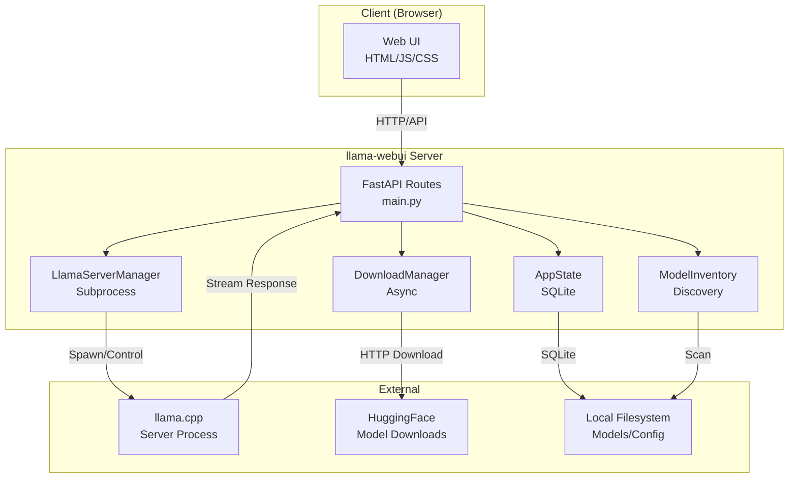
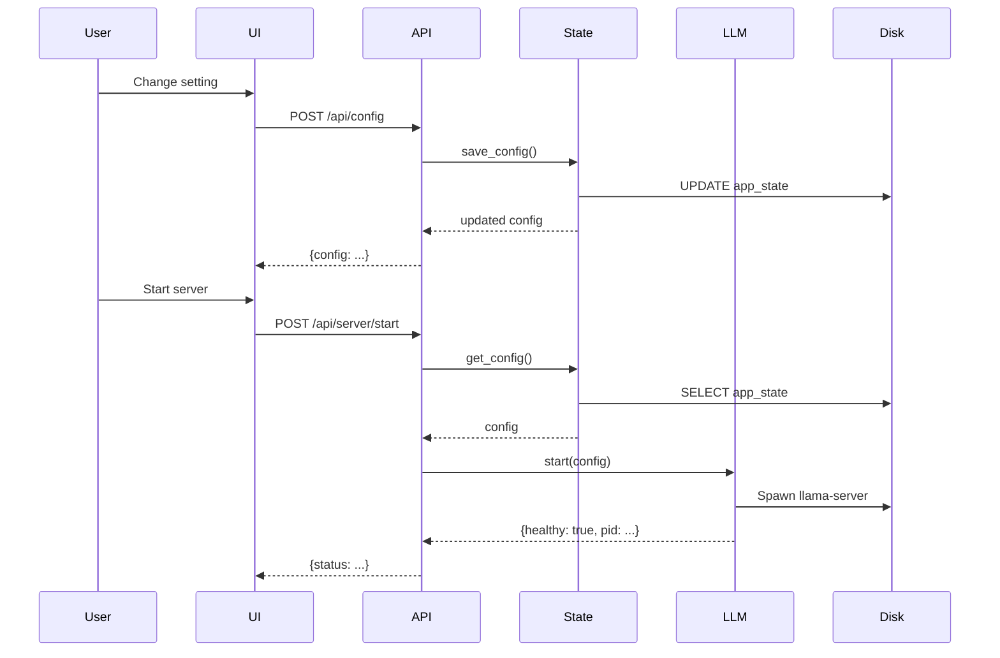

# Service Architecture

This document describes the architecture of llama-webui, including component interactions and data flow.

## High-Level Architecture



## Component Responsibilities

### AppState (`app_state.py`)
- SQLite-backed persistent storage
- Chat history management
- Configuration persistence
- Thread-safe database access

### LlamaServerManager (`llama_manager.py`)
- Spawns and manages llama-server subprocess
- Health checking of running server
- Chat completion requests (streaming and non-streaming)
- Process lifecycle management

### ModelDownloadManager (`download_manager.py`)
- Async GGUF file downloads
- Progress tracking
- Job queue management
- Cancellation support

### ModelInventory (`model_inventory.py`)
- Scans configured directories for GGUF files
- Builds model presets based on detected hardware
- Applies model-specific profiles
- Normalizes model paths

## Request Flow

### Loading a Model

1. User selects model from UI
2. Frontend POSTs to `/api/models/load`
3. `load_model()` route:
   - Applies model profile to config
   - Saves updated config to SQLite
   - Starts llama-server via `manager.start()`
4. Server spawns llama.cpp subprocess with appropriate flags
5. Health check confirms server is ready
6. Response returns updated config and status

### Sending a Chat Message

1. User submits message in UI
2. Frontend POSTs to `/api/chats/{id}/messages/stream`
3. `stream_message()` route:
   - Validates server is running (health check)
   - Creates/ensures chat exists
   - Saves user message to SQLite
   - Constructs message history for context
4. Calls `manager.chat_stream()` which:
   - POSTs to llama-server completions endpoint
   - Parses SSE stream
   - Yields delta events
5. Route streams NDJSON events back to client
6. On completion:
   - Saves assistant message to SQLite
   - Returns final chat state with latency metrics

## Data Model

### SQLite Schema

```sql
-- Application state (key-value store for config)
CREATE TABLE app_state (
  key TEXT PRIMARY KEY,
  value_json TEXT NOT NULL
);

-- Chat conversations
CREATE TABLE chats (
  chat_id INTEGER PRIMARY KEY AUTOINCREMENT,
  title TEXT NOT NULL,
  created_at TEXT NOT NULL DEFAULT CURRENT_TIMESTAMP,
  updated_at TEXT NOT NULL DEFAULT CURRENT_TIMESTAMP
);

-- Individual messages within chats
CREATE TABLE messages (
  message_id INTEGER PRIMARY KEY AUTOINCREMENT,
  chat_id INTEGER NOT NULL REFERENCES chats(chat_id) ON DELETE CASCADE,
  role TEXT NOT NULL,
  content TEXT NOT NULL,
  created_at TEXT NOT NULL DEFAULT CURRENT_TIMESTAMP
);
```

## External Dependencies

### llama.cpp
- Must be built separately and available in PATH
- Server exposes OpenAI-compatible HTTP API
- Configurable via CLI flags for hardware optimization

### Hardware Profiles
- RK3588: CPU affinity 4-7, 4 threads, KV cache quantization
- Desktop GPU: GPU layer offloading, higher batch sizes
- CPU-only: Thread count auto-detection, conservative memory usage

## Configuration Flow



## Deployment Notes

- Single-process FastAPI server
- SQLite for persistence (WAL mode enabled)
- Static file serving for UI assets
- Environment-based configuration
- No external database dependencies
